# AI 标书智能写作系统 · 展示页

**AI Bid Intelligent Writing System** 是一套面向投标团队的端到端标书生产平台，覆盖招标文件解析、
响应格式定位、评分项上下文检索、大纲生成、素材填充、AI 写作、审校、报价与文档导出全流程。

> **关于本仓库**
>
> 本仓库是**对外展示仓库**，只包含可交互的界面原型、线框图和设计文档，**不含产品源代码**。
> 产品源代码为闭源（source-available，保留所有权利），详见 [LICENSE](LICENSE)。

---

## 🔗 在线预览

| 入口 | 说明 |
| --- | --- |
| **[交互原型](https://mrwhite-art.github.io/ai-bid-system-showcase/demo/index.html)** | 用 mock 数据跑通的完整界面原型，可直接点击操作 |
| **[线框图](https://mrwhite-art.github.io/ai-bid-system-showcase/low-fi/02-dashboard.html)** | 10 张页面级线框图（登录 / 驾驶舱 / 招标 / 解析 / 大纲 / 写作 / 矩阵 / 报价 / 审校 / 导出） |
| **[界面截图](screenshots/ui/ui-02-dashboard.png)** | **真实前端界面截图** 10 张：驾驶舱 / 招标管理 / 招标解析 / AI 大纲 / 内容写作 / 响应矩阵 / 内容审校 / 知识库 / 公司信息 / 登录 |
| **[设计系统](screenshots/design-system.png)** | 色彩令牌、字体层级、圆角与阴影规范 |

---

## 解决什么问题

传统标书制作有三个反复出现的痛点，系统的设计围绕它们展开：

1. **招标文件信息分散** —— 自动抽取项目信息、评分标准、技术需求与商务条款，并保留原文溯源
   （`sourceQuote`），避免"AI 说了一个数，但找不到出处"。
2. **响应格式容易失真** —— 从标准文档中定位响应格式章节，按候选章节**复制原文素材**，
   降低表格结构与层级被模型改写、从而导致废标的风险。
3. **写作上下文不足** —— 把评分项、标准文档、知识库与企业资料关联进写作过程，
   让生成内容对着评分点写、且可追溯。

---

## 核心能力

### 1. 招标文件智能解析
- 支持 PDF / Word / ZIP 上传
- 多区域并发解析：项目信息、评分标准、技术需求、商务条款
- 解析结果保留原文证据，便于回查
- 识别标准文档章节区间，产出响应格式候选索引
- 支持"手动粘贴响应格式文件"与"系统自动定位"双通道

### 2. 响应格式与素材复用
- 从标准文档中抽取响应格式章节候选
- 大纲 / 写作 / 商务素材页面支持素材搜索与复制填充
- 商务素材采用**纯复制填充**，避免 AI 任意改写格式
- 标准文档支持重传解析与素材维护

### 3. 评分项上下文与大纲生成
- 评分点自动挂载到大纲章节
- 写作要求自动关联全文检索上下文
- 支持按评分点做语义检索，补全关联材料
- 提供覆盖缺口检查与质量阈值提醒

### 4. AI 内容写作
- 三栏工作台：大纲导航、富文本编辑、知识库参考
- 章节级自定义提示词
- SSE 流式生成
- 技术内容按需触发填充，不覆盖已确认内容
- 支持企业资料占位符与公司信息注入

### 5. 知识库与混合检索
- 知识库分类、文档管理、章节切分
- MySQL 全文检索兜底
- 向量化检索增强（智谱 `embedding-3`）
- 支持向量索引重建与进度查询
- **未配置可用向量模型时自动降级**，不影响基础检索

### 6. 审校、报价与导出
- 覆盖率、一致性、敏感信息等审校检查
- 投标报价成本拆分、利润率与总价计算
- 响应矩阵按技术 / 商务维度对照评分项
- Word / PDF 标书导出

---

## 业务流程

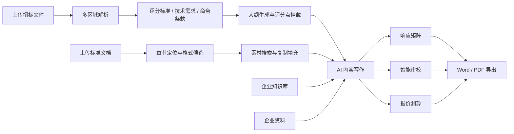

## 系统架构

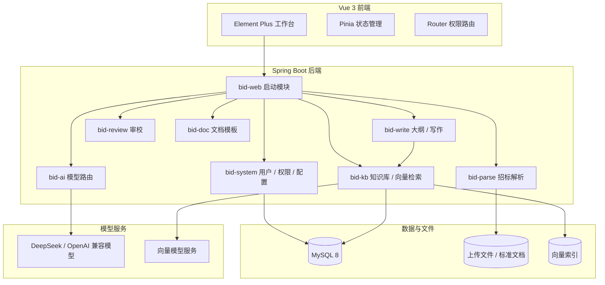

---

## 技术栈

| 层级 | 技术 |
| --- | --- |
| 后端 | Java 17、Spring Boot 3.2.5、MyBatis-Plus 3.5.6、JWT、Knife4j |
| 前端 | Vue 3、TypeScript、Vite 5、Element Plus、Pinia、WangEditor |
| 数据 | MySQL 8、MySQL FULLTEXT、向量索引 |
| AI | DeepSeek、OpenAI-compatible 协议、智谱 embedding-3 |
| 工程 | Maven 多模块、Vitest、JUnit 5、Mockito |

---

## 界面预览

以下均为**真实前端界面截图**（在本地完整部署「后端 + 前端 + 数据库」后实际运行截取，
库中数据为合成演示数据，不含任何真实客户信息）。

### 驾驶舱 · 项目总览

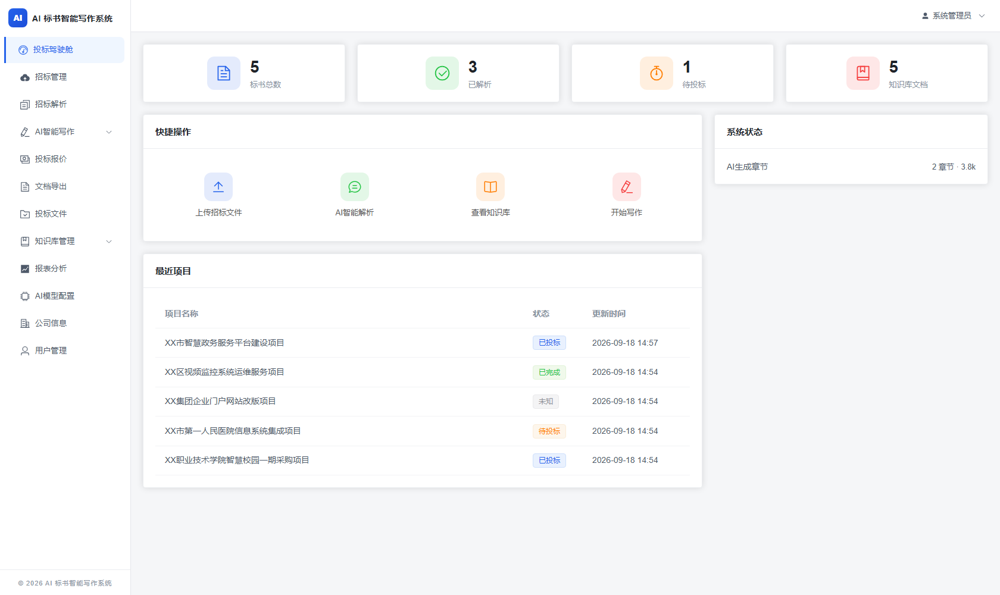

### 招标项目管理

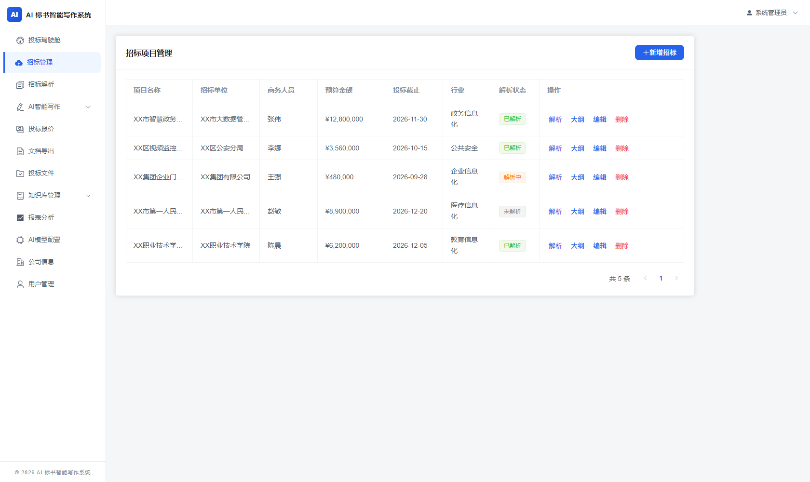

### 招标解析 · 评分标准抽取与原文溯源

左侧为项目信息与关键条款，右侧为评分标准表；每条均带「溯源」按钮，
可回查该结论在招标文件原文中的出处。

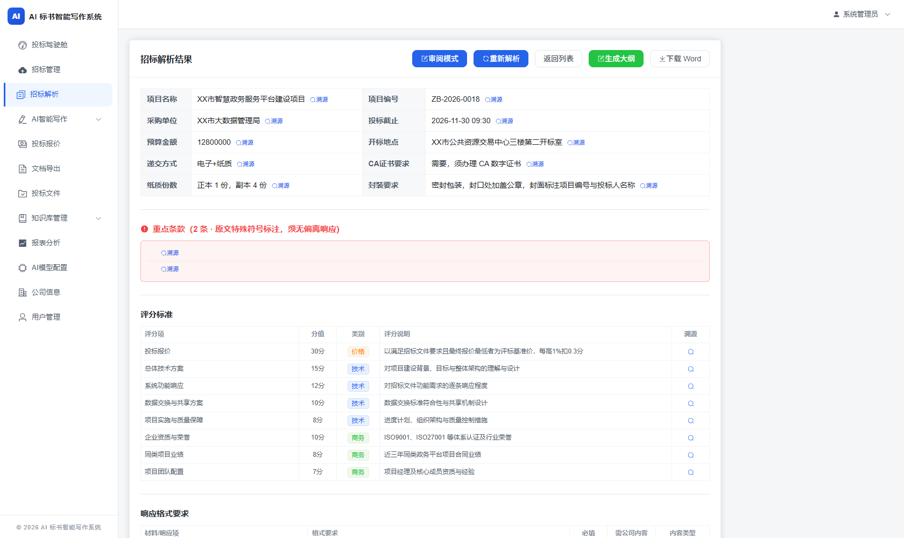

### AI 大纲生成

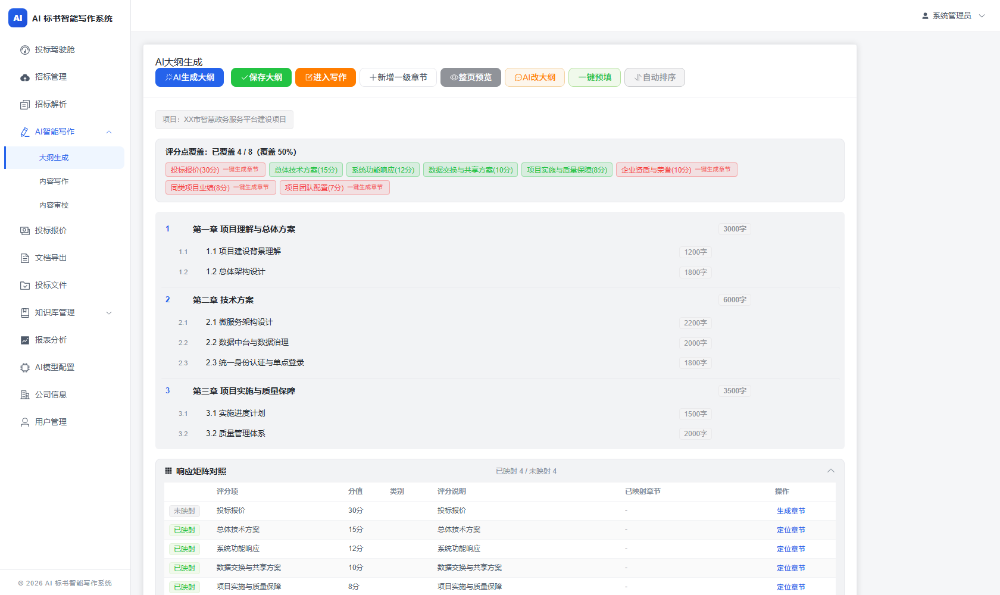

### 内容写作工作台（三栏：大纲导航 / 富文本编辑 / 知识库参考）

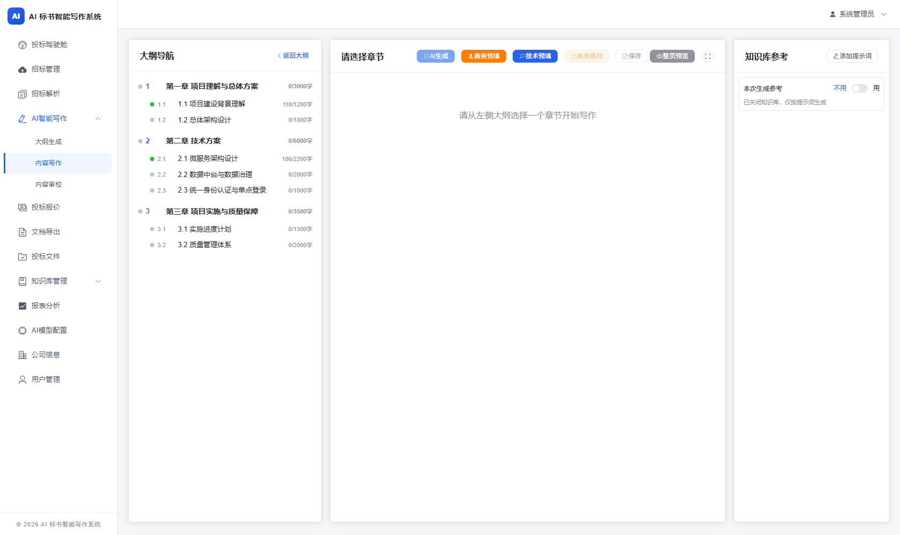

### 响应矩阵 · 技术需求逐条对照

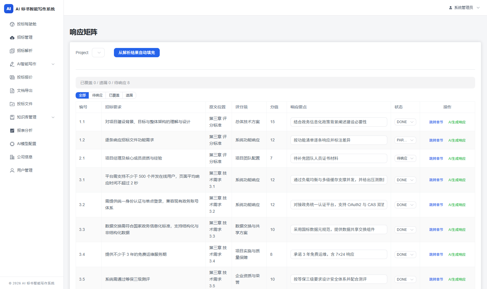

### 内容审校

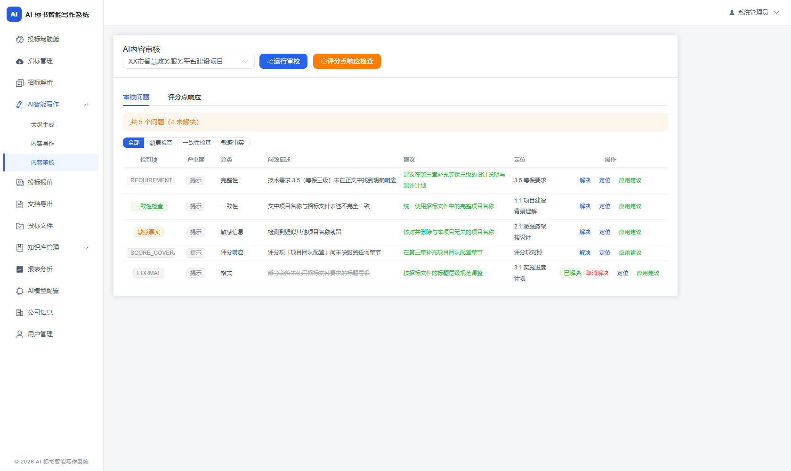

### 知识库文档管理

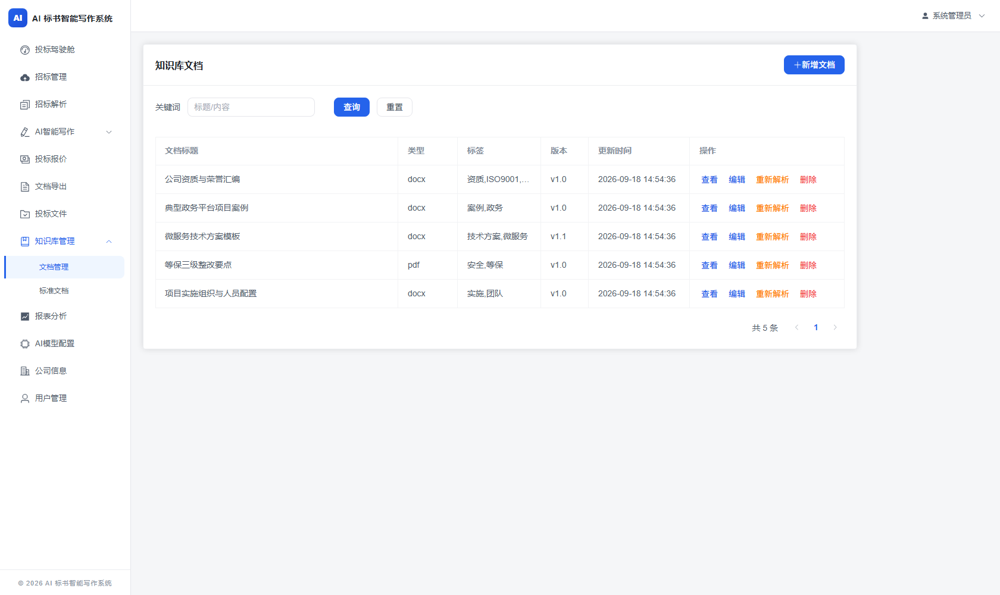

### 公司信息（企业资料占位符数据源）

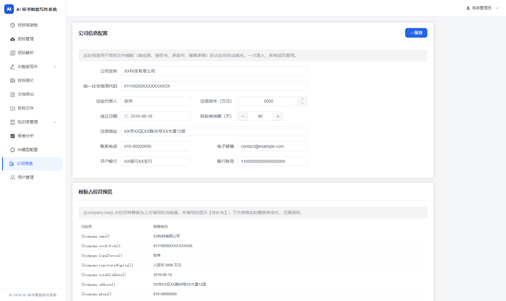

### 登录

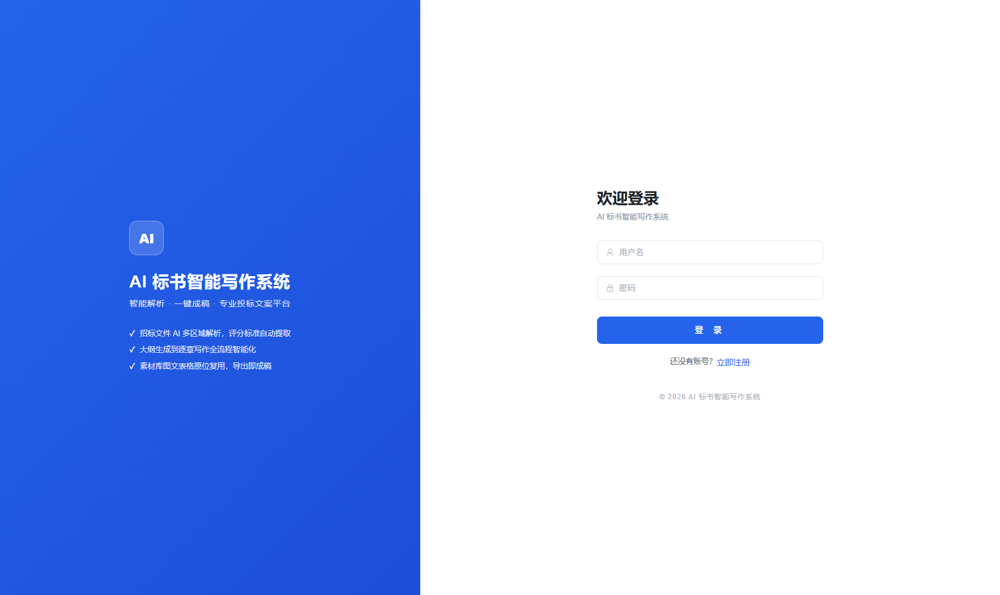

### 设计系统规范

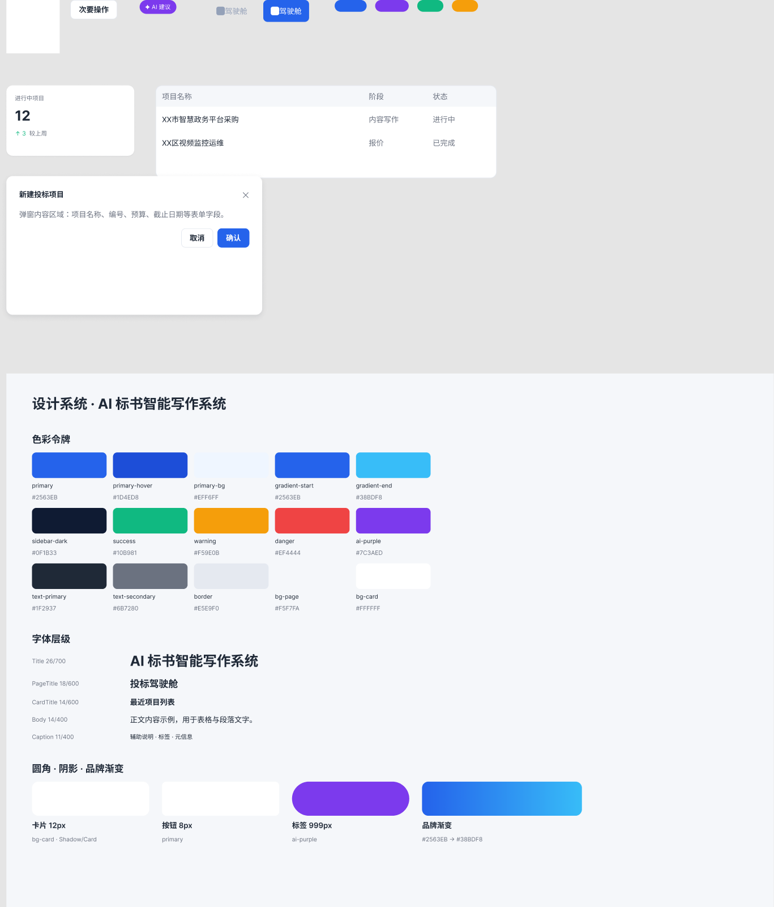

完整可交互界面见 [在线原型](https://mrwhite-art.github.io/ai-bid-system-showcase/demo/index.html)。

---

## 许可

本仓库内容（原型、线框图、文档、截图）与产品源代码**均保留所有权利**，
仅供浏览、阅读与评估。未经著作权人事先书面许可，不得使用、复制、修改、分发
或将本项目作为服务对外提供。完整条款见 [LICENSE](LICENSE)。

如需商业授权或合作，请通过 GitHub 联系仓库所有者。
